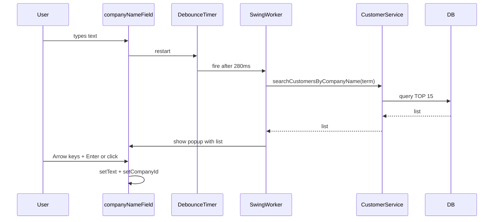

# Changelog

All notable changes to this project will be documented in this file.

The format is based on [Keep a Changelog](https://keepachangelog.com/en/1.1.0/).

## v1.1.0

### Added

- **Company name autocomplete** on the invoice screen:
  - Debounced search (Timer) + background fetch (SwingWorker)
  - Dropdown selection with keyboard navigation (Arrow keys / Enter / Escape)
  - DB-backed search (TOP N) to stay fast with large customer lists
- **Percentage-based discount** support (discount percent ↔ discount amount).
- **Per-line labor cost** for main-group invoice rows (visible in the app; excluded from Excel export).

### Changed

- **Total quantity** now sums only *main-group* rows (rows with a visible row number), excluding sub-group items.
- **Sub-group quantity calculation** now multiplies:
  - `finalQuantity = unitQuantity × parentQuantity`
  - Example: 3 main items × 3 pins per item ⇒ 9 pins total
- Invoice UI behavior updated to support the new discount and autocomplete flow (removing the need for a manual search button).

### Fixed

- Excel export improvements:
  - Hide “Total/Discount” labels and values when discount is 0
  - Show blank instead of `0` for sub-group CM values
  - Prevent summary block label/value misalignment for large invoices by using the calculated summary start row
  - Align summary styles with the template (label/value styles without borders)
- Excel template lookup improved:
  - Prefer local path `src/resources/templates/inovice_template.xlsx` before fallback paths

### Database

Run migration:
- `src/resources/sql/add_discount_and_missing_fields.sql`

This migration includes (or may require) changes such as:
- `invoices.discount_percentage` (DECIMAL)
- `invoices.discount_amount` (DECIMAL)
- `invoices.labor_cost_amount` (DECIMAL)
- `invoices.total_quantity` (INT)
- `invoice_items.labor_cost` (DECIMAL)
- Optional performance index: `IX_customers_company_name` on `customers.company_name`

### Notes

- **Important**: apply the migration script to the target database used in production (e.g. `ISKSRV`) before running the updated app.
- This repository currently ignores `*.xlsx`, so the invoice Excel template remains a **local-only asset**:
  - `src/resources/templates/inovice_template.xlsx`

### Diagram (Autocomplete flow)

### Test

- Total quantity: **3 main-group + 9 sub-group ⇒ total quantity = 3**
- Sub-group multiplication: **3 main × 3 unit ⇒ 9 final**
- Percentage discount: **1000 total, 10% ⇒ 100 discount ⇒ 900 final (plus labor if any)**
- Labor cost: per main row, summed into final amount; not exported to Excel

