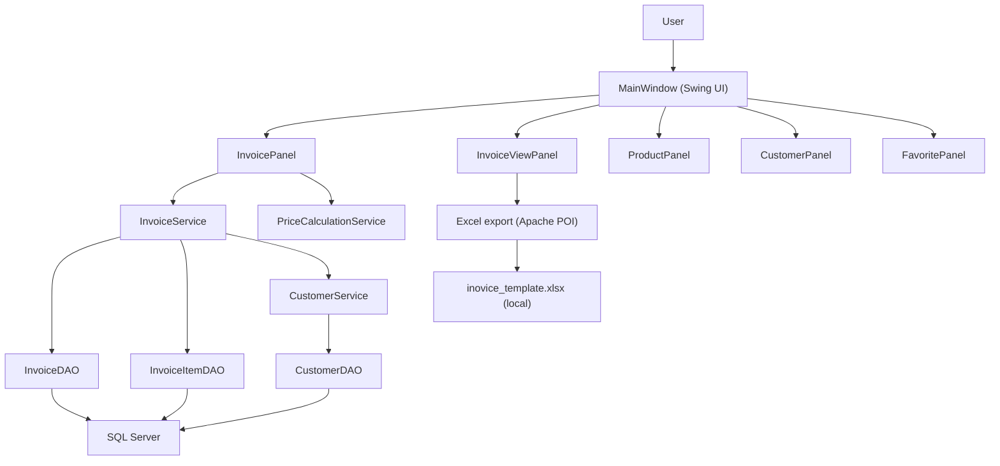

# BicakClc Invoice Management System

Java Swing-based desktop application for managing **invoices**, **products**, **customers**, and related business operations.  
Uses **Microsoft SQL Server** for persistence and supports exporting invoices to **Excel** (Apache POI).

## Features

- Invoice creation with **group/sub-group item logic**
- **Percentage-based discount** support
- **Per-line labor cost** (visible in the app; excluded from Excel export)
- Invoice viewing, filtering, and Excel export (single invoice or all)
- Product & category management
- Customer (company) management with **company-name autocomplete**
- Favorites management

## Tech stack

- **Java (Swing)** UI
- **SQL Server** + JDBC (`mssql-jdbc`)
- **Apache POI** for Excel export

## Project structure

```
src/
  com/bicakclc/
    main/      Application entry point
    ui/        Swing UI panels (InvoicePanel, InvoiceViewPanel, MainWindow, ...)
    service/   Business logic
    dao/       Data access layer (SQL Server)
    model/     Data models (Invoice, InvoiceItem, Product, Customer, ...)
    util/      Utilities (DatabaseConnection, constants, ...)
  resources/
    sql/       SQL scripts (schema + migrations)
    templates/ Excel template (local, ignored by git)
lib/          External JARs (add to classpath)
bin/          Compiled output (ignored by git)
```

## Setup & run

### Prerequisites

- **JDK 11+** (the commonly used SQL Server driver for this project targets Java 11)
- **Microsoft SQL Server** (Express or Standard)
- An IDE (Eclipse / IntelliJ IDEA) or your preferred Java runner

### 1) Create database tables

Run:

- `src/resources/sql/create_invoice_tables.sql`

### 2) Apply migrations (existing DBs)

If you already have a database and you’re updating to a newer version, run:

- `src/resources/sql/add_discount_and_missing_fields.sql`

### 3) Configure database connection

The application reads DB settings from `config.properties` in the repository root (if present).  
This file is **gitignored** (to avoid committing secrets).

1. Copy the example:
   - `config.properties.example` → `config.properties`
2. Edit values as needed.

Windows Authentication note:
- If you use `integratedSecurity=true`, you must place the correct `mssql-jdbc_auth-*.dll` into your JDK `bin/` directory.

### 4) Add library dependencies

Place the required JARs under `lib/` and add them to the **classpath** (not modulepath).  
See `lib/README.txt` for the expected JAR list.

### 5) Provide the Excel template (local)

This repository currently ignores `*.xlsx`, so the template is not committed.  
To enable Excel export, make sure the template exists locally at:

- `src/resources/templates/inovice_template.xlsx`

### 6) Run the app

Run the main class:

- `com.bicakclc.main.BicakClcApplication` (`src/com/bicakclc/main/BicakClcApplication.java`)

## Project Architecture



## Troubleshooting

- **`ClassNotFoundException` / `NoClassDefFoundError`**: verify all JARs are on the classpath.
- **DB connection errors**:
  - Ensure SQL Server is running and reachable.
  - Verify `db.url` (and `db.username` / `db.password` if using SQL auth) in `config.properties`.
  - For Windows auth, ensure the `mssql-jdbc_auth` DLL is installed into the JDK `bin/`.

## Changelog

See `CHANGELOG.md`.

## License

See `LICENSE` (Non-Commercial Portfolio License).

