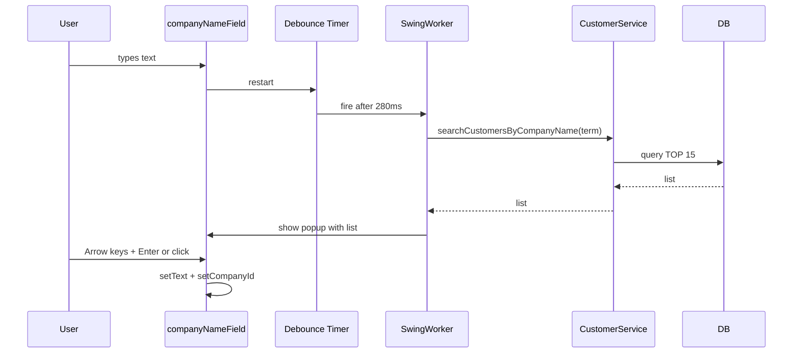

===========================================
ORIJINAL NOTLAR (Kısa Özet)
===========================================

1. Faturadaki Toplam adet kısmında sadece sıra numarası olan ürünlerin (Ana grup üyelerinin) adetlerinin toplamı yazılsın.

2. Faturadaki alt grup üyelerinin her birinin adet sayısı ile ana grup üyesinin adet sayısı çarpılsın. 
   Örnek: 19mm tek-çift taraf bir çelik var diyelim bundan 3 adet yapıcaz, her birinde de 3 adet pim olucak 
   yani toplam 9 adet pim olucak toplamda.

3. İskonto mevzusunda ise direk numerik olarak değil yüzdelik olarak iskonto (indirim) uygulanıcak, 
   bunun matematiksel mantığını da ekle.

4. Birde faturada işçiliği her bir ana grup üyesinin olduğu satıra ayrı ayrı yazmak istiyorum. 
   Unutma bunlar Excel'e dökülen faturada gözükmeyecek ama ben uygulamadan görebileceğim.

===========================================
DETAYLI UYGULAMA PLANI
===========================================

# Fatura Sistemi Güncelleme Planı

## 1. Toplam Adet Hesaplaması Düzeltmesi

**Amaç:** Faturadaki "Toplam Adet" alanında sadece ana grup ürünlerinin (sıra numarası olan, `productCode=1`) 
adetlerinin toplamı gösterilecek. Alt grup ürünleri toplam adete dahil edilmeyecek.

**Değişiklik Yapılacak Dosyalar:**
- `src/com/bicakclc/ui/InvoicePanel.java`

**Kod Detayları:**
```java
// InvoicePanel.java - calculateTotals() metodunda değişiklik
// Mevcut kod (satır 623-641):
for (int i = 0; i < invoiceTableModel.getRowCount(); i++) {
    try {
        BigDecimal rowTotal = new BigDecimal(invoiceTableModel.getValueAt(i, 6).toString());
        totalAmount = totalAmount.add(rowTotal);
        
        Object rowNumber = invoiceTableModel.getValueAt(i, 0);
        if (rowNumber != null && !rowNumber.toString().isEmpty()) {
            int rowQuantity = Integer.parseInt(invoiceTableModel.getValueAt(i, 5).toString());
            totalQuantity += rowQuantity;
        }
    } catch (Exception e) { }
}
```

**Açıklama:** 
- Satır 633-637: Zaten sıra numarası (`rowNumber`) kontrolü yapılıyor
- Boş olmayan sıra numarası = ana grup ürünü
- Bu kod bloğu zaten doğru çalışıyor, ama doğrulaması yapılmalı

**Test Senaryosu:**
- 3 adet çelik (ana grup) + 9 adet pim (alt grup) = Toplam Adet: 3 göstermeli

---

## 2. Alt Grup Otomatik Adet Çarpımı

**Amaç:** Alt grup ürünü eklenirken, girilen birim adet ile ana grup ürününün adedi otomatik çarpılacak 
ve tabloda çarpılmış değer gösterilecek.

**Örnek:**
- Ana grup: 3 adet "19mm Çelik"
- Alt grup: 3 birim "Pim" girilir
- Sonuç: Tabloda 9 adet pim gösterilir (3 × 3 = 9)

**Değişiklik Yapılacak Dosyalar:**
- `src/com/bicakclc/ui/InvoicePanel.java`
- `src/com/bicakclc/model/InvoiceItem.java` (opsiyonel: birim adet bilgisini saklamak için)

**Kod Detayları:**
```java
// InvoicePanel.java - addItemToInvoice() metodunda (satır 501-562)
// Mevcut kod zaten kısmen bu mantığı uyguluyor ama daha belirgin hale getirilmeli

// GÜNCELLEME: Alt grup tespit mantığı
// Eğer ürün productCode != "1" ise ve üstte ana grup varsa:
if (!"1".equals(selectedProduct.getProductCode())) {
    // Son ana grubu bul
    int parentQuantity = 1;
    for (int i = invoiceTableModel.getRowCount() - 1; i >= 0; i--) {
        Object prevRowNumber = invoiceTableModel.getValueAt(i, 0);
        if (prevRowNumber != null && !prevRowNumber.toString().isEmpty()) {
            // Ana grup bulundu
            parentQuantity = Integer.parseInt(invoiceTableModel.getValueAt(i, 5).toString());
            break;
        }
    }
    // Çarpımı yap
    int finalQuantity = quantity * parentQuantity;
    item.setQuantity(finalQuantity);
    
    // Toplam hesaplama
    if (cmValue != null) {
        total = price.multiply(BigDecimal.valueOf(finalQuantity)).multiply(cmValue);
    } else {
        total = price.multiply(BigDecimal.valueOf(finalQuantity));
    }
    item.setTotal(total);
}
```

**Ek Düzenleme:** `updateRowTotal()` metodunda (satır 580-622) zaten bu mantık var, ancak netleştirilmeli.

**InvoiceItem modeline eklenebilir (opsiyonel):**
```java
// InvoiceItem.java - Birim adet bilgisini saklamak için
private Integer unitQuantity; // Alt grup için birim adet
private Integer calculatedQuantity; // Ana grup × birim adet = hesaplanmış adet
```

---

## 3. Yüzdelik İskonto (İndirim) Sistemi

**Amaç:** Kullanıcı hem yüzdelik hem de doğrudan tutar olarak iskonto girebilecek. 
Yüzde girildiğinde, toplam tutarın yüzdesi otomatik hesaplanarak indirilecek.

**Matematiksel Mantık:**
- İskonto Tutarı = Toplam Tutar × (İskonto Yüzdesi / 100)
- Örnek: 1000 TL × (10 / 100) = 100 TL indirim
- Son Tutar = Toplam Tutar - İskonto Tutarı + İşçilik
- Örnek: 1000 TL - 100 TL + 50 TL = 950 TL

**Değişiklik Yapılacak Dosyalar:**
- `src/com/bicakclc/ui/InvoicePanel.java`
- `src/com/bicakclc/model/Invoice.java` (diskonto yüzdesi alanı eklenecek)
- Veritabanı şeması güncellenmeli (discount_percentage kolonu)

**UI Değişiklikleri:**
```java
// InvoicePanel.java - createRightPanel() metodunda (satır 290-297)
// Mevcut kod:
gbc2.gridx = 0; gbc2.gridy = 3;
totalsPanel.add(new JLabel("İskonto Tutarı:"), gbc2);
gbc2.gridx = 1;
discountField = new JTextField(15);
discountField.setText("0.00");
totalsPanel.add(discountField, gbc2);

// YENİ KOD: İki alan ekle
// İskonto Yüzdesi
gbc2.gridx = 0; gbc2.gridy = 3;
totalsPanel.add(new JLabel("İskonto (%):"), gbc2);
gbc2.gridx = 1;
JTextField discountPercentageField = new JTextField(10);
discountPercentageField.setText("0");
totalsPanel.add(discountPercentageField, gbc2);

// İskonto Tutarı (hem okuyabilir hem yazabilir)
gbc2.gridx = 0; gbc2.gridy = 4;
totalsPanel.add(new JLabel("İskonto Tutarı:"), gbc2);
gbc2.gridx = 1;
discountField = new JTextField(10);
discountField.setText("0.00");
discountField.setEditable(true); // Direkt tutar da girilebilir
totalsPanel.add(discountField, gbc2);
```

**Hesaplama Mantığı:**
```java
// calculateTotals() metodunda güncelleme (satır 647-654)
BigDecimal discountAmount = BigDecimal.ZERO;

// Önce yüzdelik iskonto kontrol et
if (!discountPercentageField.getText().trim().isEmpty()) {
    try {
        BigDecimal discountPercent = new BigDecimal(discountPercentageField.getText().trim());
        // totalAmount'un yüzdesini hesapla
        discountAmount = totalAmount.multiply(discountPercent)
                                    .divide(BigDecimal.valueOf(100), 2, RoundingMode.HALF_UP);
        // Hesaplanan tutarı göster
        discountField.setText(discountAmount.toString());
    } catch (NumberFormatException e) { }
}

// Eğer direkt tutar girilmişse onu kullan
if (!discountField.getText().trim().isEmpty()) {
    try {
        BigDecimal directAmount = new BigDecimal(discountField.getText().trim());
        // Eğer direkt tutar yüzdelikten farklıysa, yüzdeyi güncelle
        if (totalAmount.compareTo(BigDecimal.ZERO) > 0) {
            BigDecimal percent = directAmount.multiply(BigDecimal.valueOf(100))
                                             .divide(totalAmount, 2, RoundingMode.HALF_UP);
            discountPercentageField.setText(percent.toString());
        }
        discountAmount = directAmount;
    } catch (NumberFormatException e) { }
}
```

**Model Güncellemesi:**
```java
// Invoice.java - Yeni alan ekle
private BigDecimal discountPercentage; // İskonto yüzdesi

public BigDecimal getDiscountPercentage() {
    return discountPercentage;
}

public void setDiscountPercentage(BigDecimal discountPercentage) {
    this.discountPercentage = discountPercentage;
    // Yüzde değiştiğinde tutar da hesaplanabilir
    if (this.totalAmount != null && discountPercentage != null) {
        this.discountAmount = totalAmount.multiply(discountPercentage)
                                        .divide(BigDecimal.valueOf(100), 2, RoundingMode.HALF_UP);
        calculateFinalAmount();
    }
}
```

**Veritabanı:**
```sql
-- invoices tablosuna eklenecek kolon
ALTER TABLE invoices ADD COLUMN discount_percentage DECIMAL(5,2) DEFAULT 0.00;
```

---

## 4. Satır Bazlı İşçilik Bilgisi

**Amaç:** Her ana grup ürünü için ayrı işçilik tutarı girilecek. Bu işçilikler uygulama içinde 
görülecek ama Excel'e aktarımda dahil edilmeyecek. Tüm satır işçiliklerinin toplamı "Son Tutar"a eklenecek.

**Değişiklik Yapılacak Dosyalar:**
- `src/com/bicakclc/ui/InvoicePanel.java`
- `src/com/bicakclc/model/InvoiceItem.java`
- `src/com/bicakclc/dao/InvoiceItemDAO.java`
- `src/com/bicakclc/ui/InvoiceViewPanel.java`

**Tablo Güncellemesi:**
```java
// InvoicePanel.java - createInvoiceTable() metodunda (satır 334-357)
// Mevcut kolonlar: Sıra, Ürün Adı, Kategori, Fiyat, CM, Adet, Toplam
// YENİ kolonlar: Sıra, Ürün Adı, Kategori, Fiyat, CM, Adet, İşçilik, Toplam

String[] columnNames = {"Sıra", "Ürün Adı", "Kategori", "Fiyat", "CM", "Adet", "İşçilik", "Toplam"};
invoiceTableModel = new DefaultTableModel(columnNames, 0) {
    @Override
    public boolean isCellEditable(int row, int column) {
        // Fiyat (3), CM (4), Adet (5), İşçilik (6), Toplam (7) düzenlenebilir
        // Ama İşçilik sadece ana grup satırlarında düzenlenebilir
        if (column == 6) { // İşçilik kolonu
            Object rowNumber = getValueAt(row, 0);
            // Sadece sıra numarası varsa (ana grup) düzenlenebilir
            return rowNumber != null && !rowNumber.toString().isEmpty();
        }
        return column == 3 || column == 4 || column == 5 || column == 7;
    }
};
```

**Satır Ekleme Güncellemesi:**
```java
// InvoicePanel.java - addItemToInvoice() metodunda (satır 549-557)
// Mevcut ekleme:
invoiceTableModel.addRow(new Object[]{
    rowNumberToShow,
    item.getProductName(),
    categoryName,
    item.getPrice(),
    item.getCmValue(),
    item.getQuantity(),
    item.getTotal()
});

// YENİ ekleme (İşçilik kolonu eklendi):
BigDecimal laborCost = BigDecimal.ZERO; // Başlangıç değeri
invoiceTableModel.addRow(new Object[]{
    rowNumberToShow,
    item.getProductName(),
    categoryName,
    item.getPrice(),
    item.getCmValue(),
    item.getQuantity(),
    laborCost, // YENİ: İşçilik kolonu
    item.getTotal()
});
```

**Toplam Hesaplama Güncellemesi:**
```java
// InvoicePanel.java - calculateTotals() metodunda (satır 624-667)
BigDecimal totalAmount = BigDecimal.ZERO;
BigDecimal totalLaborCost = BigDecimal.ZERO; // YENİ
int totalQuantity = 0;

for (int i = 0; i < invoiceTableModel.getRowCount(); i++) {
    try {
        // Toplam tutar hesabı (kolon indeksi 7'ye kaydı)
        BigDecimal rowTotal = new BigDecimal(invoiceTableModel.getValueAt(i, 7).toString());
        totalAmount = totalAmount.add(rowTotal);
        
        // Sadece ana grup satırları için
        Object rowNumber = invoiceTableModel.getValueAt(i, 0);
        if (rowNumber != null && !rowNumber.toString().isEmpty()) {
            int rowQuantity = Integer.parseInt(invoiceTableModel.getValueAt(i, 5).toString());
            totalQuantity += rowQuantity;
            
            // İşçilik toplamı (kolon 6)
            Object laborValue = invoiceTableModel.getValueAt(i, 6);
            if (laborValue != null && !laborValue.toString().isEmpty()) {
                BigDecimal rowLabor = new BigDecimal(laborValue.toString());
                totalLaborCost = totalLaborCost.add(rowLabor);
            }
        }
    } catch (Exception e) { }
}

// Global işçilik alanını kaldır, yerine satır toplamını kullan
// laborCostField alanını kaldır veya salt okunur yap
laborCostField.setText(totalLaborCost.toString());
laborCostField.setEditable(false);

// Son tutar hesabı
BigDecimal finalAmount = totalAmount.subtract(discountAmount).add(totalLaborCost);
finalAmountLabel.setText(String.format("%.2f TL", finalAmount));
```

**Model Güncellemesi:**
```java
// InvoiceItem.java - Yeni alan ekle
private BigDecimal laborCost; // Satır bazlı işçilik

public BigDecimal getLaborCost() {
    return laborCost;
}

public void setLaborCost(BigDecimal laborCost) {
    this.laborCost = laborCost;
}
```

**DAO Güncellemesi:**
```java
// InvoiceItemDAO.java - create ve update metodlarında labor_cost kolonu eklenecek
String sql = "INSERT INTO invoice_items (invoice_id, product_id, parent_item_id, price, " +
             "cm_value, quantity, total, sub_group, row_number, labor_cost) " +
             "VALUES (?, ?, ?, ?, ?, ?, ?, ?, ?, ?)";

// ... 
pstmt.setBigDecimal(10, item.getLaborCost());
```

**Veritabanı:**
```sql
-- invoice_items tablosuna eklenecek kolon
ALTER TABLE invoice_items ADD COLUMN labor_cost DECIMAL(10,2) DEFAULT 0.00;
```

**Excel Export Güncellemesi:**
```java
// InvoiceViewPanel.java - exportSelectedInvoiceToExcel() metodunda (satır 641-661)
// Header satırı: İşçilik kolonunu EKLEME
String[] exportHeaders = {"Sıra", "Ürün Adı", "CM", "Adet", "Birim Fiyat", "Toplam"};
// İşçilik kolonu Excel'e dahil edilmeyecek

// Satır ekleme (satır 686-771): İşçilik kolonunu atlayarak export yap
// Mevcut kod zaten işçilik eklememiş, değişiklik gerekmez
```

**InvoiceViewPanel - showInvoiceDetailsDialog:**
```java
// InvoiceViewPanel.java - showInvoiceDetailsDialog() metodunda (satır 326)
// Kolon isimleri güncelle
String[] columnNames = {"Sıra", "Ürün Adı", "Fiyat", "CM", "Adet", "İşçilik", "Toplam"};

// Satır eklerken işçilik kolonunu dahil et (satır 350-357)
itemsModel.addRow(new Object[]{
    rowNumberToShow,
    productName,
    String.format("%.2f TL", item.getPrice()),
    item.getCmValue() != null ? item.getCmValue().toString() : "",
    item.getQuantity(),
    item.getLaborCost() != null ? String.format("%.2f TL", item.getLaborCost()) : "0.00 TL", // YENİ
    String.format("%.2f TL", item.getTotal())
});
```

---

## 5. Excel Export İyileştirmeleri (Fatura Detay Excel)

**Dosya:** `src/com/bicakclc/ui/InvoiceViewPanel.java`

- **Toplam ve İskonto:** İskonto 0 ise Excel'de "Toplam Tutar" ve "İskonto" hem değer hem etiket ("Toplam:", "İskonto:") gizlenir; iskonto 0 değilse gösterilir.
- **CM sütunu:** Alt gruplarda CM değeri 0 ise hücrede 0 yerine boşluk gösterilir.
- **Özet bloğu kayması:** Çok ürünlü faturalarda özet (Toplam, İskonto, Son Tutar, Toplam Adet) hesaplanan satıra yazılıyor; named range yerine `summaryStartRow + i` kullanılıyor, böylece etiket/değer kayması olmuyor.
- **Özet hücre stilleri:** Özet bloğunda kenarlık yok; şablondaki görünüme uyum için `summaryLabelStyle` / `summaryValueStyle` kullanılıyor.
- **Template yolu:** Şablon önce `src/resources/templates/inovice_template.xlsx` konumunda aranıyor; classpath ve diğer disk yolları yedek olarak deneniyor.

---

## 6. Fatura Oluşturma – Firma Adı Autocomplete

**Amaç:** Fatura ekranında firma adı yazarken otomatik tamamlama (autocomplete): yazıldıkça veritabanından arama, sonuçların dropdown’da gösterilmesi, seçimle alanın doldurulması. Açılışta tüm müşteri listesi yüklenmez; yüzlerce firma olsa bile hızlı çalışır.

**Değişiklik yapılan dosyalar:**
- `CustomerDAO.java` – `searchCustomersByCompanyName(term, maxResults)` (sadece company_name, TOP N)
- `CustomerService.java` – `searchCustomersByCompanyName(term)`, `isCompanyNameExists(name)`
- `InvoicePanel.java` – Ara butonu kaldırıldı; DocumentListener + debounce Timer (280 ms) + SwingWorker + popup (JWindow + JList); ok tuşu / Enter / Escape; seçimde `setCompanyId`; `companyPopup == null` kontrolü; seçim sonrası popup’ın tekrar açılmaması için `skipNextCompanySearch` bayrağı
- `add_discount_and_missing_fields.sql` – `customers.company_name` için isteğe bağlı index

**Akış (özet):**



---

## Değişiklik Özeti

### Dosya Değişiklikleri
- InvoicePanel.java - Ana değişiklikler, firma autocomplete
- InvoiceViewPanel.java - Görüntüleme güncellemesi
- Invoice.java - İskonto yüzdesi alanı
- InvoiceItem.java - İşçilik alanı
- InvoiceItemDAO.java - Veritabanı işlemleri
- CustomerDAO.java - searchCustomersByCompanyName (firma arama, TOP 15)
- CustomerService.java - searchCustomersByCompanyName, isCompanyNameExists

### Veritabanı Değişiklikleri

**ÖNEMLİ: Bu SQL scriptlerinin ISKSRV veritabanında da çalıştırılması gerekiyor!**

Migration Script (Mevcut veritabanı için):
- Dosya: `src/resources/sql/add_discount_and_missing_fields.sql`
- Bu script ISKSRV'de çalıştırılmalı

```sql
-- İskonto yüzdesi
ALTER TABLE invoices ADD COLUMN discount_percentage DECIMAL(5,2) DEFAULT 0.00;

-- İskonto tutarı (eğer yoksa)
ALTER TABLE invoices ADD COLUMN discount_amount DECIMAL(15,2) DEFAULT 0.00;

-- İşçilik maliyeti (eğer yoksa)
ALTER TABLE invoices ADD COLUMN labor_cost_amount DECIMAL(15,2) DEFAULT 0.00;

-- Toplam adet (eğer yoksa)
ALTER TABLE invoices ADD COLUMN total_quantity INT DEFAULT 0;

-- Satır bazlı işçilik
ALTER TABLE invoice_items ADD COLUMN labor_cost DECIMAL(10,2) DEFAULT 0.00;

-- Firma autocomplete hızı için (customers tablosu varsa)
-- add_discount_and_missing_fields.sql içinde: IX_customers_company_name index
```

**ISKSRV'de Yapılması Gerekenler:**
1. `add_discount_and_missing_fields.sql` scriptini ISKSRV veritabanında çalıştır
2. Veya manuel olarak yukarıdaki ALTER TABLE komutlarını çalıştır
3. Değişikliklerin uygulandığını doğrula

### Test Senaryoları
1. **Toplam Adet**: 3 ana grup + 9 alt grup = 3 toplam adet göstermeli
2. **Alt Grup Çarpım**: 3 çelik × 3 pim birim = 9 pim görünmeli
3. **Yüzdelik İskonto**: 1000 TL toplam, %10 iskonto = 100 TL indirim = 900 TL son tutar
4. **İşçilik**: Her ana grup satırına 50 TL işçilik, 3 satır = 150 TL toplam işçilik eklenmeli son tutara

===========================================
UYGULAMA SIRASI (TODO LİSTESİ)
===========================================

1. ✅ Model güncellemeleri (Invoice ve InvoiceItem)
2. ✅ DAO güncellemeleri (InvoiceItemDAO)
3. ✅ Veritabanı şeması güncellemesi
4. ✅ InvoicePanel - Tablo yapısı güncelleme (İşçilik kolonu ekleme)
5. ✅ InvoicePanel - İskonto UI güncellemeleri
6. ✅ InvoicePanel - Alt grup çarpım mantığı
7. ✅ InvoicePanel - Toplam hesaplama güncellemesi
8. ✅ InvoiceViewPanel - Detay görüntüleme güncellemesi
9. ✅ Excel export kontrolü
10. ✅ Entegrasyon testleri
11. ✅ Excel: İskonto 0 iken toplam/iskonto gizleme; alt gruplarda CM 0 → boş
12. ✅ Fatura firma adı autocomplete (debounce, popup, seçim sonrası tekrar açılmayı engelleme)

